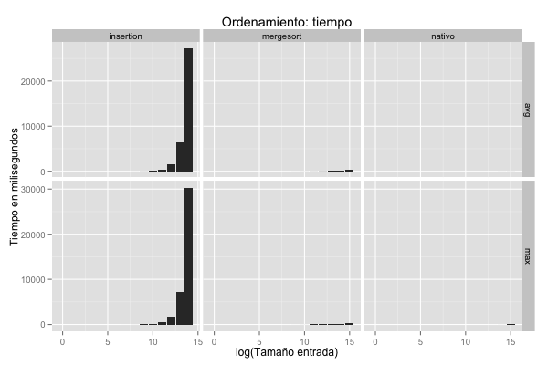
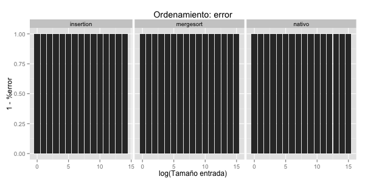
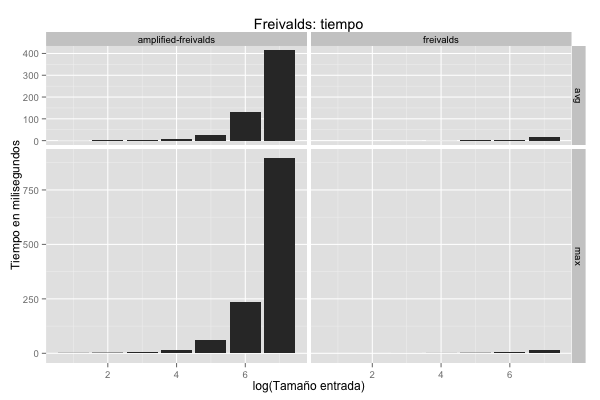
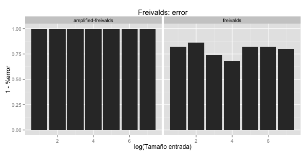
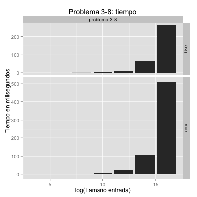
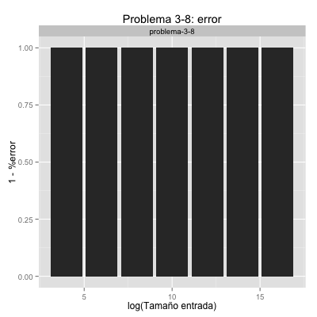

<table>
	<tr>
		<th colspan="2" style="text-align:center">
			<br/>
			Universidad Sim&oacute;n Bol&iacute;var<br/>
			Departamento de Computaci&oacute;n y Tecnolog&iacute;a de la Informaci&oacute;n<br/>
			Laboratorio de Algoritmos y Estructuras de Datos II (CI 2692)
	</tr>
	<tr>
		<th scope="row">Asignaci&oacute;n:</th>
		<td style="text-align:right">Laboratorio 2</td>
	</tr>
	<tr>
		<th scope="row">Modalidad:</th>
		<td style="text-align:right">Parejas</td>
	</tr>
	<tr>
		<th scope="row">Ponderación:</th>
		<td style="text-align:right">2%</td>
	</tr>
	<tr>
		<th scope="row">Asignado:</th>
		<td style="text-align:right">Jueves, 3 de mayo de 2018 (sem 2)</td>
	</tr>
	<tr>
		<th scope="row">Entrega:</th>
		<td style="text-align:right">Sábado, 5 de mayo de 2018 (sem 2)</td>
	</tr>
</table>

### Lab-02: Ordenamiento por mezcla, algoritmo de Freivalds, y ejercicio

#### Objetivos:

1. Implementar el algoritmo de ordenamiento por mezcla (mergesort) y comparlo con 
ordenamiento por inserci&oacute;n y el algoritmo de ordenamiento nativo de Python.

1. Implementar el algoritmo de Freivalds para la verificaci&oacute;n de multiplicaci&oacute;n
de matrices cuadradas. Disminuir la probabilidad de error del algoritmo.

1. Resolver un problema de programaci&oacute;n.

Cada grupo debe entregar el c&oacute;digo implementado y un informe haciendo commit 
en el repositorio.

Todos los procedimientos se deben implementar dentro de la plantilla `lab_02.py` 
en la parte del archivo prevista para ello. Las *firmas* de cada procedimiento son las siguientes:

```
def mergesort(A):
def freivalds(n, A, B, C):
def amplified_freivals(k, n, A, B, C):
def problema_3_8(A, x):
```

Todos los algoritmos se eval&uacute;an de forma *autom&aacute;tica* sobre fuentes
de datos provistas y se generan estad&iacute;sticos de tiempo de ejecuci&oacute;n.
Una vez que se hayan implementado los algoritmos, los experimentos se ejecutan desde
el *shell* de una de las siguiente formas:

```
python lab_02.py > data.csv
python lab_02.py | tee data.csv
```

La primera forma *redirecciona* la salida de la ejecuci&oacute;n al archivo ```data.csv```.
La segunda forma utiliza el programa ```tee``` de unix para mostrar por pantalla la salida y
redireccionarla al archivo ```data.csv```.

Luego usamos el programa estad&iacute;stico R para generar gr&aacute;ficas del tiempo 
de corrida y error:

```
R --no-save < common/plots/plot_lab_02.R
```

Se generan 6 gr&aacute;ficas que deben lucir de la siguiente forma:









#### Archivos de entrada:
Se proporcionan 4 archivos de entrada en la carpeta `data`.

Nuevamente se proporcionan archivos peque&ntilde;os para que puedan probar su programa:
* `carnets.txt`, el cual se encuentra ordenado, le permitirá probar el mejor caso
* `nombres.txt`, el cual se encuentra desordenado, le permitirá probar el caso promedio
* `stenrac.txt` (carnets invertido), el cual se encuentra en orden inverso, le permitirá probar el peor caso

El archivo para evaluar los tiempos de sus implementaciones es `web2`,
una variaci&oacute;n del archivo`english.txt` del laboratorio 1 con 1519 palabras
agregadas fuera de sitio.

#### 1. Ordenamiento por mezcla

Ordenamiento por mezcla llama a la rutina ```merge(A, p, q, r)``` para mezclar
los subarreglos ```A[p..q]``` y ```A[q+1..r]``` que se asumen ordenados de menor
a mayor. Como se vio en clase, lo primero que hace ```merge(A, p, q, r)``` es 
*copiar* los subarreglos en arreglos ```L``` y ```R```. 

En python, uno obtiene una copia del subarreglo ```A[p..q]``` tomando una "rebanada"
(*slice*) del arreglo con ```A[p:q+1]```. (Observe que el segundo &iacute;ndice es 
```q+1``` en lugar de ```q```).

Modifique el procedimiento ```merge(A, p, q, r)``` visto en clase para que no utilice 
los *sentinelas*.


#### 2. Algoritmo de Freivalds

La firma del algoritmo es ```freivalds(n, A, B, C)``` donde ```n``` es un entero
para la dimensi&oacute;n de las matrices, y ```A```, ```B``` y ```C``` son matrices
de dimensi&oacute;n n x n. El algoritmo debe retornar ```True``` o ```False```
dependiendo si el producto A x B es igual a C.

El procedimiento ```freivalds(n, A, B, C)``` debe llamar a una rutina para multiplicar
una matriz A, de dimensi&oacute;n n x n, por un vector ```z``` de dimensi&oacute;n n.
La firma de dicho procedimiento debe ser ```multiply(n, A, z)``` y debe retornar el
vector de tama&ntilde;o n que resulta de la multiplicaci&oacute;n.

En python, creamos un vector de n ceros con ```n * [0]```, y creamos una matriz de 
dimensi&oacute;n n x n de ceros con ```[ n * [0] for i in range(n) ]``` como una
lista de n listas cada una con n ceros. El elemento (i,j) de la matriz ```A``` se
obtiene con ```A[i][j]```.

Para generar un entero aleatorio en el intervalo ```[a,b]```, llamamos a la rutina
```Random(a,b)```. Dicha rutina est&aacute; implementada en el c&oacute;digo que
se distribuye en el repositorio del proyecto.

Para disminuir la probabilidad de error del algoritmo de Freivalds, lo ejecutamos
k veces. El algoritmo de amplificaci&oacute;n que llama al algoritmo de Freivalds
es inclu&iacute;do en la plantilla.


#### 3. Ejercicio

Cada grupo debe resolver el siguinte problema (Ejercicio 8 de la 3ra clase):

Dise&ntilde;e un algoritmo que corra en tiempo &Theta;(n log n) que dado un
arreglo A[p..r] con n = r − p + 1 enteros y un entero x, determine si existen
&iacute;ndices i y j tales que p &le; i &lt; j &le; r y A[i] + A[j] = x.

La firma del algoritmo debe ser ```problema_3_8(A, x)```. El algoritmo debe retornar
```True``` si existen dichos &iacute;ndices y ```False``` si no existen.

*Ayuda: lo primero que debe hacer es ordenar el arreglo ```A``` con mergesort. Luego
debe usar el procedimiento de busqueda binaria.*


